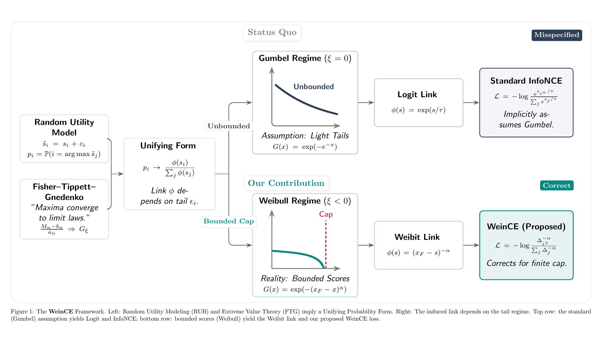
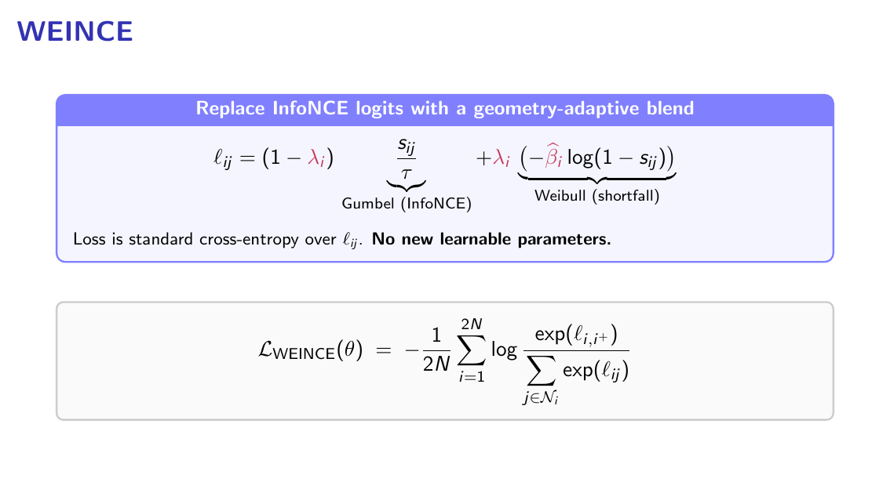
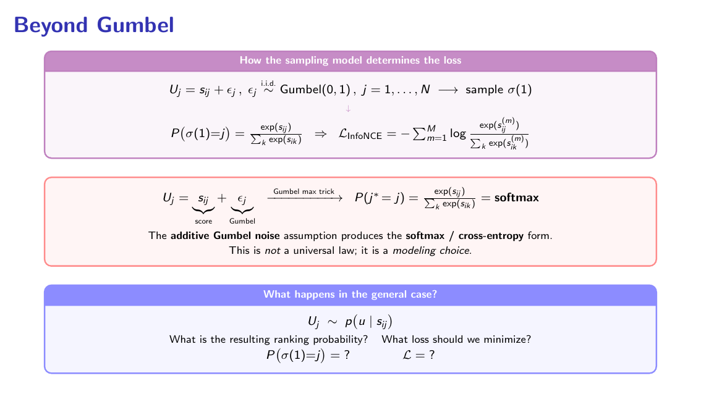
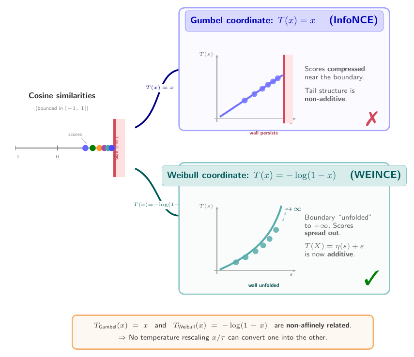
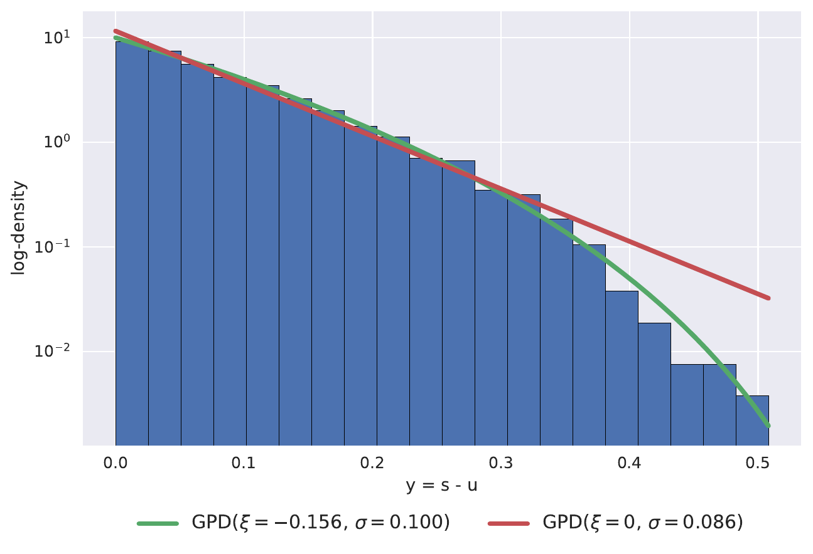
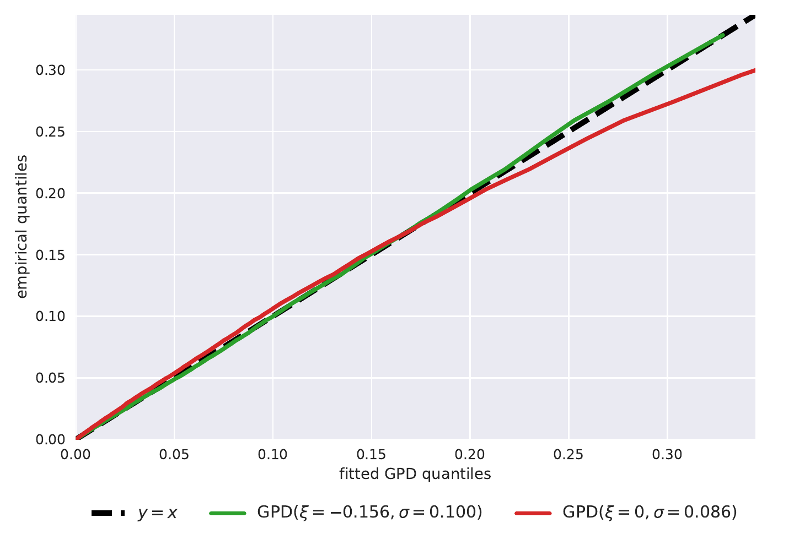
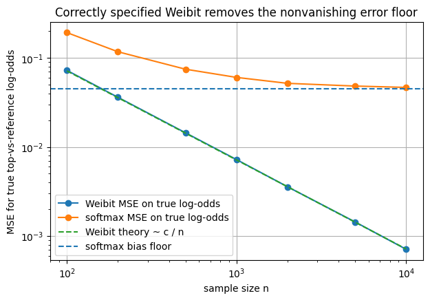

# WEINCE: When Softmax Fails at the Top

**WEINCE authors:** Melihcan Erol, Suat Evren, Oktay Ozel, Alexander Morgan, Jongha Jon Ryu, and Lizhong Zheng.

**Code lineage:** this repository builds on the MIT licensed PyTorch SimCLR implementation by **Janne Spijkervet**. The original SimCLR copyright notice is retained in [`LICENSE`](LICENSE). See [`AUTHORS.md`](AUTHORS.md) and [`NOTICE.md`](NOTICE.md) for full attribution.

<p align="center">
  
</p>

WEINCE is a drop in replacement for InfoNCE in contrastive learning. It keeps the SimCLR training pipeline unchanged, but replaces the logits used inside the cross entropy with an anchor adaptive blend of the usual softmax coordinate and a Weibull shortfall coordinate.

The starting point is simple. The softmax in InfoNCE is not just a convenient normalization. It corresponds to an additive Gumbel random utility model for the top scoring candidate. Modern contrastive learning often uses cosine similarity, which is bounded above by 1. Hard negatives live near that finite endpoint. In that regime, extreme value theory points to a Weibull shortfall geometry rather than a pure Gumbel geometry.

WEINCE uses the current minibatch to estimate which anchors show near endpoint behavior, then applies the correction only for those anchors. The tail statistics are stop gradient quantities. **No new learnable parameters are introduced.**

<p align="center">
  
</p>

PDF version: [`docs/assets/weince_loss.pdf`](docs/assets/weince_loss.pdf)

## Modeling idea

<p align="center">
  
</p>

The standard InfoNCE link is recovered when utilities are scores plus independent Gumbel noise. That assumption gives the softmax probability. WEINCE asks a different question: if the score space is bounded, and the active hard negatives are near the upper endpoint, what coordinate better describes top one selection?

The answer is to unfold the endpoint by moving from the raw score coordinate to a shortfall coordinate.

<p align="center">
  
</p>

PDF version: [`docs/assets/fig_coordinate_lens.pdf`](docs/assets/fig_coordinate_lens.pdf)

## Tail evidence

A frozen encoder shows endpoint behavior in the high similarity tail. The POT diagnostic fits a generalized Pareto model to high negative cosine similarities. The Weibull shaped fit respects the finite score cap, while a Gumbel fit keeps assigning mass past the cap.

| Exceedance density | QQ diagnostic |
|---|---|
|  |  |

PDF versions: [`exceedance_plot_single_3_epoch_70_gpd_fit.pdf`](docs/assets/exceedance_plot_single_3_epoch_70_gpd_fit.pdf), [`pot_fit_qq_single_3_epoch_70.pdf`](docs/assets/pot_fit_qq_single_3_epoch_70.pdf)


## Synthetic noise floor

The repository also includes a small synthetic experiment that illustrates the misspecification floor behind the softmax link when the data are generated from an endpoint shortfall law. A correctly specified Weibit estimator decays like `c / n`, while a restricted translation coordinate softmax keeps a nonvanishing bias floor.

<p align="center">
  
</p>

Run it with:

```bash
python synthetic/noise_floor_simulation.py
```

See [`synthetic/README.md`](synthetic/README.md) for the notebook, script, and details.

## What changes in code?

The baseline path is the standard SimCLR NT-Xent objective:

```text
main.py
policy = pl
```

The WEINCE path uses the tail adaptive logit interpolation:

```text
main_hard_select.py
policy = tlambda_select
```

The resulting logits are still passed to the same cross entropy over the SimCLR candidate set. The encoder, projection head, augmentations, optimizer, temperature, and evaluation protocol remain the same.

## CIFAR100 ResNet18 reproduction

This cleaned repository includes a focused reproduction workflow for the CIFAR100 ResNet18 rows in Tables 2 and 3 of the paper. It has only two training modes:

1. Baseline InfoNCE, using `main.py` with `policy=pl`.
2. WEINCE, using `main_hard_select.py` with `policy=tlambda_select`.

The scripts train the encoder, run linear evaluation, run kNN evaluation, and save results in the layout expected by `notebooks/analyze_cifar100_r18_repro.ipynb` and `scripts/aggregate_table23_r18.py`.

### Added files

```text
slurm/submit_cifar100_r18_baseline.slurm
slurm/submit_cifar100_r18_weince.slurm
scripts/aggregate_table23_r18.py
notebooks/analyze_cifar100_r18_repro.ipynb
notebooks/analyze_exceedances.ipynb
synthetic/noise_floor_simulation.py
synthetic/noise_floor_simulation.ipynb
synthetic/noise_floor.png
docs/assets/
```

### Environment

The SLURM scripts assume the environment used in the experiments:

```bash
module load miniforge/24.3.0-0
module load cuda/12.4.0
conda activate rlenv
```

Override the conda environment name with:

```bash
export CONDA_ENV_NAME=rlenv
```

Skip module loading and conda activation inside the scripts with:

```bash
export SKIP_ENV=1
```

### Common variables

Run all commands from the repository root.

```bash
export REPO_ROOT=$PWD
export DATA_ROOT=/path/to/cifar_data_root
```

`DATA_ROOT` is passed to `torchvision.datasets.CIFAR100`. The dataset will be downloaded there if needed.

### Run the baseline

The baseline uses the four pretraining seeds used in the table collection:

```text
7, 21, 63, 84
```

Submit the baseline array:

```bash
BASE_JOB=$(sbatch --parsable --array=0-3 \
  --export=ALL,REPO_ROOT=$PWD,DATA_ROOT=$DATA_ROOT,OUTPUT_ROOT=$PWD/outputs_cifar100_r18_baseline_repro \
  slurm/submit_cifar100_r18_baseline.slurm)
```

Each baseline task trains one encoder, then runs:

```text
linear evaluation seeds: 1, 2, 3, 4, 5
kNN split seeds:        1, 2, 3, 4, 5
```

### Run WEINCE

The WEINCE sweep uses the same four pretraining seeds and the `tlambda_select` grid used by the table collection:

```text
select_aic_margin in {0, 2, 6}
select_kappa_rho  in {5, 10, 20}
select_kappa_aic  in {0.5, 1.0, 2.0}
seeds             in {7, 21, 63, 84}
```

This gives 108 array tasks.

```bash
WEINCE_JOB=$(sbatch --parsable --array=0-107 \
  --export=ALL,REPO_ROOT=$PWD,DATA_ROOT=$DATA_ROOT,OUTPUT_ROOT=$PWD/outputs_policy_tlambda_select_cifar100_r18_repro \
  slurm/submit_cifar100_r18_weince.slurm)
```

Each WEINCE task trains one encoder, then runs:

```text
linear evaluation seed: 1
kNN split seeds:       1, 2, 3, 4, 5
```

### Aggregate the results

After both arrays finish, run:

```bash
python scripts/aggregate_table23_r18.py \
  --baseline-dir $PWD/outputs_cifar100_r18_baseline_repro \
  --weince-dir $PWD/outputs_policy_tlambda_select_cifar100_r18_repro \
  --out-dir $PWD/table23_r18_repro_summary
```

The aggregation script writes table style CSV files, run completeness checks, validation grid summaries, and comparisons against the reported CIFAR100 ResNet18 numbers.

The selection rule mirrors the paper protocol:

1. Linear evaluation averages probe seeds within each pretrained encoder seed.
2. It chooses one configuration by validation accuracy, using only complete four encoder seed configurations.
3. kNN averages split seeds within each pretrained encoder seed.
4. kNN chooses the best configuration separately for each validation kNN metric, then reports the corresponding test metric.

## Analysis notebooks

### Table reproduction notebook

Open:

```text
notebooks/analyze_cifar100_r18_repro.ipynb
```

Set paths in the first configuration cell if needed:

```python
BASELINE_DIR = "../outputs_cifar100_r18_baseline_repro"
WEINCE_DIR = "../outputs_policy_tlambda_select_cifar100_r18_repro"
OUT_DIR = "../table23_r18_repro_summary"
```

The notebook produces table style CSVs, a WEINCE validation grid plot, run completeness tables, and comparisons against the reported CIFAR100 ResNet18 rows.

### Exceedance diagnostic notebook

Open:

```text
notebooks/analyze_exceedances.ipynb
```

It takes one frozen SimCLR checkpoint, either as a local path or as a Google Drive link, collects high negative cosine similarities, and produces four endpoint tail diagnostic plots:

1. POT exceedance density on log log axes.
2. POT exceedance density on linear axes.
3. QQ plot comparing Weibull GPD and Gumbel GPD fits.
4. POT shape stability plot across thresholds.

Edit the first configuration cell:

```python
CHECKPOINT_SOURCE = "PASTE_GOOGLE_DRIVE_LINK_OR_LOCAL_CHECKPOINT_PATH_HERE"
DATA_ROOT = "./data"
DATASET = "CIFAR100"
RESNET = "resnet18"
```

## Rendered figure sources

All rendered assets are kept in `docs/assets/`. The LaTeX sources used to generate the Markdown figures are kept in `docs/assets/latex/`.

```text
docs/assets/weince_loss.pdf
docs/assets/beyond_gumbel.pdf
docs/assets/fig_coordinate_lens.pdf
docs/assets/conceptual_figure.pdf
docs/assets/pot_fit_qq_single_3_epoch_70.pdf
docs/assets/exceedance_plot_single_3_epoch_70_gpd_fit.pdf
```

## Base project, authors, and license

WEINCE was developed by Melihcan Erol, Suat Evren, Oktay Ozel, Alexander Morgan, Jongha Jon Ryu, and Lizhong Zheng.

This repository began as the PyTorch SimCLR implementation by **Janne Spijkervet**, implementing *A Simple Framework for Contrastive Learning of Visual Representations* by Chen et al. The WEINCE reproduction keeps the SimCLR training and evaluation pipeline and changes only the contrastive logit construction.

The project is distributed under the MIT License. Because this is a derivative of the original SimCLR implementation, `LICENSE` includes both the WEINCE authors' 2026 copyright notice and Janne Spijkervet's original 2020 MIT copyright notice. See [`AUTHORS.md`](AUTHORS.md), [`NOTICE.md`](NOTICE.md), and [`LICENSE`](LICENSE) for the full attribution and licensing text.

